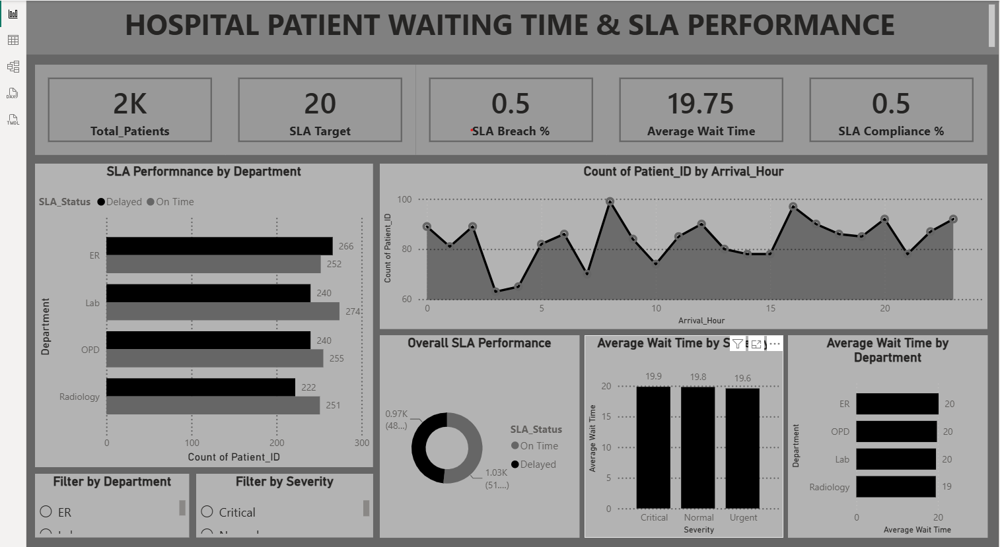

# 🏥 Hospital Patient Waiting Time & SLA Performance Analysis

An end-to-end **Hospital Patient Waiting Time & SLA Analysis** project
built to analyze patient waiting times, service-level agreement (SLA)
performance, department performance, patient severity, and arrival
patterns.

The project follows a complete analytics workflow:

**MySQL → CSV → Python / Google Colab → Data Cleaning & EDA → Power BI
Dashboard**

> **Note:** The hospital dataset is synthetically generated for learning
> and portfolio purposes and does not contain real patient data.

------------------------------------------------------------------------

## 📊 Dashboard Preview



The Power BI dashboard provides an interactive overview of hospital
waiting-time and SLA performance, with department and severity-level
analysis.

------------------------------------------------------------------------

## 🎯 Project Objective

The main objective of this project is to understand:

-   How long patients wait before being seen by a doctor
-   Whether patients are being seen within the defined **20-minute SLA
    target**
-   Which departments experience the highest waiting times
-   Which departments have better SLA compliance
-   How patient severity relates to waiting time
-   Which hours have the highest patient arrivals
-   Which arrival hours have the highest delay rates

This project demonstrates how raw operational data can be transformed
into meaningful business insights using SQL, Python, and Power BI.

------------------------------------------------------------------------

## 🗄️ Data Generation & MySQL

The initial hospital patient dataset was created in **MySQL**.

A hospital table was created and populated with **2,000 patient
records**. The dataset contains information related to patient arrival,
doctor response time, department, severity, and waiting time.

After creating and populating the table in MySQL, the data was exported
to CSV for further analysis.

### Dataset Fields

  Column               Description
  -------------------- ----------------------------------------------------
  `Patient_ID`         Unique identifier for each patient
  `Arrival_Time`       Date and time when the patient arrived
  `Doctor_Seen_Time`   Date and time when the patient was seen
  `Department`         Hospital department handling the patient
  `Severity`           Patient severity level
  `Wait_Time_Min`      Patient waiting time in minutes
  `Arrival_Hour`       Hour extracted from the arrival timestamp
  `SLA_Status`         Whether the patient was seen within the SLA target

### Departments

-   ER
-   OPD
-   Lab
-   Radiology

### Severity Levels

-   Critical
-   Urgent
-   Normal

------------------------------------------------------------------------

## 🐍 Python / Google Colab Analysis

After exporting the MySQL table to CSV, the dataset was analyzed in
**Google Colab using Python**.

### Libraries Used

-   **Pandas** --- data loading, inspection, transformation, grouping
    and analysis
-   **NumPy** --- numerical operations
-   **Matplotlib** --- visualization
-   **Seaborn** --- statistical/data visualizations

### Data Inspection

The first stage of the Python workflow included:

-   Loading the CSV dataset
-   Inspecting the first rows
-   Checking data types and non-null values
-   Generating descriptive statistics
-   Reviewing the distribution of waiting times
-   Checking categorical fields such as department and severity

The dataset contains **2,000 patient records and 6 original columns**.
The waiting-time variable has an average of approximately **19.75
minutes**, with values ranging from approximately **5.04 to 34.99
minutes**.

------------------------------------------------------------------------

## 🧹 Data Transformation

Additional analytical fields were created in Python.

### Arrival Hour

The patient's arrival timestamp was converted into an hourly value:

``` python
df['Arrival_Hour'] = pd.to_datetime(df['Arrival_Time']).dt.hour
```

This allowed the analysis to identify the busiest arrival hours.

### SLA Status

A **20-minute SLA target** was defined.

Patients with a waiting time of **20 minutes or less** were classified
as `On Time`, while patients waiting more than 20 minutes were
classified as `Delayed`.

``` python
df['SLA_Status'] = df['Wait_Time_Min'].apply(
    lambda x: 'On Time' if x <= 20 else 'Delayed'
)
```

The resulting dataset was exported as:

`cleaned_hospital_dataset.csv`

------------------------------------------------------------------------

## 📈 Exploratory Data Analysis

The Python analysis explored several operational questions:

### 1. Overall SLA Performance

The analysis found:

-   **51.60%** of patients were seen within the 20-minute SLA target
-   **48.40%** of patients exceeded the SLA target

### 2. Average Waiting Time

The overall average patient waiting time was approximately:

**19.75 minutes**

### 3. Department Performance

The department-level analysis compared waiting times and SLA status
across:

-   ER
-   OPD
-   Lab
-   Radiology

**ER** had the highest average waiting time at approximately **20.18
minutes**, making it a potential area for operational improvement.

**Lab** had the best SLA performance, with approximately **53.31%** of
patients being seen on time.

### 4. Severity Analysis

Waiting time was also analyzed by patient severity.

**Critical** patients had the highest average waiting time at
approximately **19.85 minutes**.

### 5. Arrival-Time Analysis

Patient arrivals were analyzed across all 24 hours of the day.

The busiest arrival hour was:

**08:00 --- 99 patient arrivals**

The highest observed delay rate occurred at:

**19:00 --- 54.12% delayed**

------------------------------------------------------------------------

## 📊 Power BI Dashboard

The cleaned dataset was then imported into **Microsoft Power BI** to
build an interactive dashboard.

### Dashboard KPIs

The dashboard focuses on:

-   Total Patients
-   SLA Target
-   SLA Breach %
-   Average Wait Time
-   SLA Compliance %

### Dashboard Visualizations

The dashboard includes:

#### SLA Performance by Department

Compares `On Time` vs `Delayed` patient counts across hospital
departments.

#### Patient Arrivals by Hour

Shows the number of patients arriving during each hour of the day.

#### Overall SLA Performance

Provides an overall comparison between patients meeting and exceeding
the SLA target.

#### Average Wait Time by Severity

Compares average waiting time for:

-   Critical
-   Normal
-   Urgent

#### Average Wait Time by Department

Shows which departments have higher or lower average patient waiting
times.

### Interactive Filters

The dashboard also includes filters for:

-   Department
-   Severity

These allow users to explore the hospital's SLA performance from
different operational perspectives.

------------------------------------------------------------------------

## 🔄 Project Workflow

``` text
                MySQL
                  │
                  ▼
        Create Hospital Table
                  │
                  ▼
       Generate 2,000 Records
                  │
                  ▼
           Export to CSV
                  │
                  ▼
        Google Colab / Python
                  │
        ┌─────────┴─────────┐
        ▼                   ▼
   Data Inspection       Data Analysis
        │                   │
        └─────────┬─────────┘
                  ▼
        Create Analytical Fields
        • Arrival_Hour
        • SLA_Status
                  │
                  ▼
      Export Cleaned Dataset
                  │
                  ▼
             Power BI
                  │
                  ▼
       Interactive Dashboard
                  │
                  ▼
          Business Insights
```

------------------------------------------------------------------------

## 🛠️ Tools & Technologies

  Tool               Purpose
  ------------------ -----------------------------------------
  **MySQL**          Database creation and data generation
  **SQL**            Table creation and data handling
  **CSV**            Data transfer between tools
  **Python**         Data inspection and analysis
  **Pandas**         Data manipulation and analysis
  **NumPy**          Numerical operations
  **Matplotlib**     Data visualization
  **Seaborn**        Exploratory visualizations
  **Google Colab**   Python analysis environment
  **Power BI**       Interactive dashboard and KPI reporting
  **GitHub**         Project version control and portfolio

------------------------------------------------------------------------

## 📁 Repository Structure

``` text
Hospital-SLA-Analysis/
│
├── Hospital_SLA.pbix
├── Hospital_SLA_Analysis.ipynb
├── hospital_data.csv
├── cleaned_hospital_dataset.csv
├── dashboard.png
├── README.md
└── LICENSE
```

------------------------------------------------------------------------

## 💡 Key Business Insights

Based on the analysis:

1.  **Almost half of the patients (48.40%) exceeded the 20-minute SLA
    target**, indicating a significant opportunity to improve patient
    flow.
2.  **ER recorded the highest average waiting time (20.18 minutes)** and
    therefore represents an important department for investigation.
3.  **Lab achieved the strongest SLA performance**, with approximately
    53.31% of patients being seen on time.
4.  **Critical patients had the highest average waiting time**,
    suggesting that high-severity cases should be examined carefully
    from a resource-allocation perspective.
5.  **08:00 was the busiest arrival hour**, with 99 patient arrivals.
6.  **19:00 had the highest delay rate**, with 54.12% of patients
    exceeding the SLA target.

These findings can help hospital operations teams identify potential
staffing, scheduling, and patient-flow bottlenecks.

------------------------------------------------------------------------

## 🚀 Future Improvements

Potential extensions for this project include:

-   Add monthly and daily waiting-time trends
-   Add date-based Power BI filtering
-   Create a dedicated SLA breach analysis page
-   Analyze waiting time by day of week
-   Add department-level SLA percentages directly to the dashboard
-   Add conditional formatting for SLA breaches
-   Add more detailed DAX measures
-   Add SQL analysis queries to the repository
-   Connect Power BI directly to MySQL instead of using CSV
-   Add automated data refresh
-   Add staffing/resource analysis if additional hospital data becomes
    available

------------------------------------------------------------------------

## 📌 Project Outcome

This project demonstrates an end-to-end **data analytics workflow**,
starting from database creation and data generation in MySQL, moving
through Python-based inspection and exploratory analysis, and ending
with an interactive Power BI dashboard.

It showcases practical skills in:

**SQL • MySQL • Python • Pandas • EDA • Data Cleaning • Data
Transformation • Power BI • Dashboard Design • KPI Analysis • Business
Insights**

------------------------------------------------------------------------

## 📄 License

This project is available under the MIT License.
